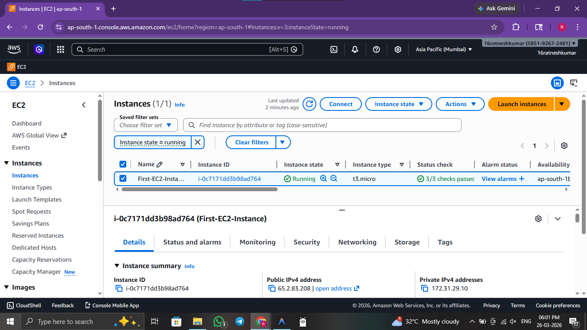
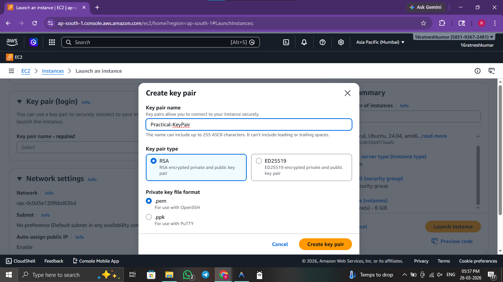
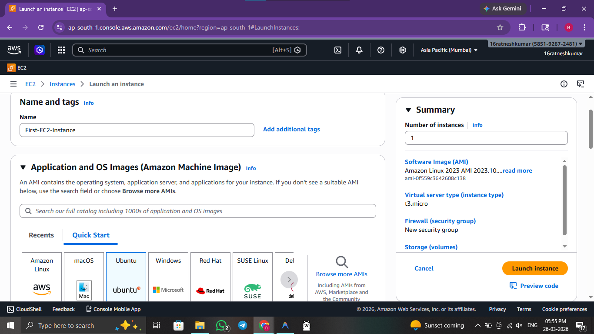
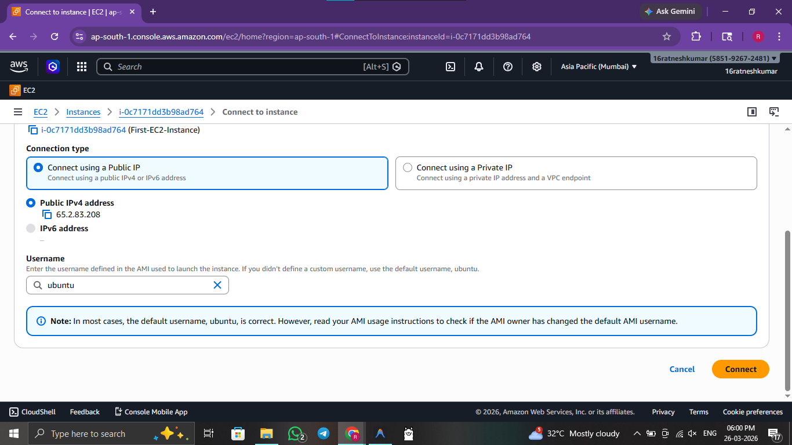
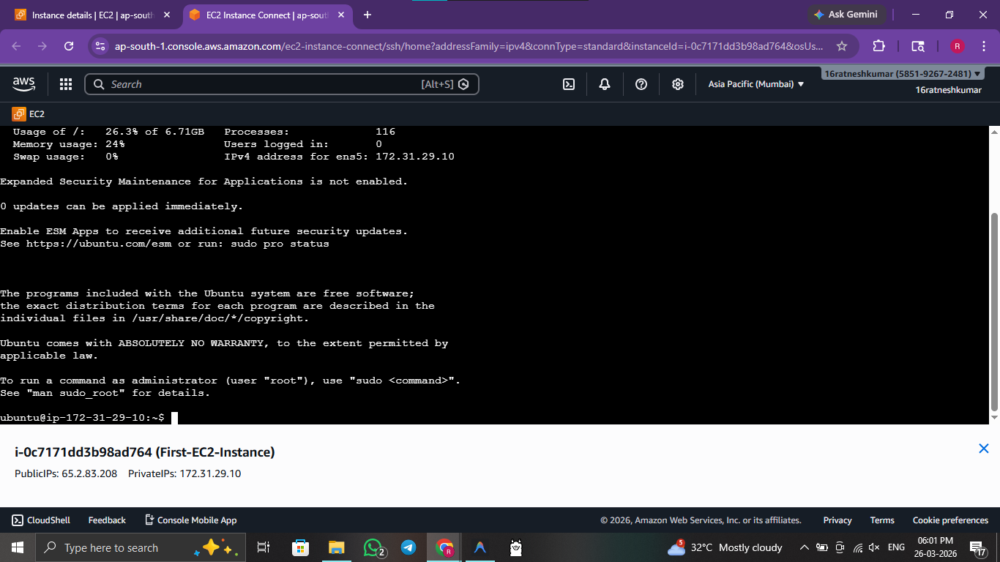

# ☁️ Practical 2: Launch Your First Amazon EC2 Instance

 

> **Objective:** Deploy a virtual machine on AWS using Amazon EC2 properly configured with a secure key pair.

---


## 🖥️ Method 1: Console / GUI Guide (AWS Management Console)

If you prefer to provision infrastructure manually via the Management Console, follow these steps:

1. **Log In:** Access the **AWS Management Console** and navigate to the **EC2 Dashboard**.
2. **Create Key Pair:** Click **Key Pairs** on the left pane and create a new RSA key pair named `cloud-key` (download the `.pem` file).
3. **Initiate Launch:** Click **Launch instances**.
4. **Choose OS:** Name the instance and select the **Amazon Linux** OS image.
5. **Select Key:** Select the `cloud-key` key pair you just created.
6. **Launch:** Click **Launch instance**.
7. **Verify & Connect:** Wait for it to become `Running`, then connect via EC2 Instance Connect or using an SSH client connecting to the Public IPv4 address using your downloaded `.pem` file.

---

## 🚀 Method 2: Automated Script Guide

For rapid, reproducible deployments, use the provided bash scripts.

### 🔍 Script Analysis
| Script Name | Action Performed |
| :--- | :--- |
| `2_compute_deploy.sh` | 🟢 **Generates** a fully configured EC2 instance utilizing a designated SSH keypair (`cloud-key`). It automatically sets up a stylized computing dashboard webpage to verify the server is running. |
| `2_compute_cleanup.sh` | 🔴 **Cleans up** the instance, the associated security group, and entirely removes the private key `.pem` file from your local machine. |


### 🛠️ Usage Instructions

**Prerequisites:** 
- AWS CLI installed and configured with active credentials.

Execute the following commands from the root directory:

```bash
# 1. Navigate to scripts folder
cd scripts/

# 2. Provide execution permission
chmod +x 2_compute_deploy.sh 2_compute_cleanup.sh

# 3. Launch specialized EC2 instance and key pair
./2_compute_deploy.sh      

# 4. Terminate EC2 instance and clean local keys
./2_compute_cleanup.sh     
```

### 🖼️ Result / Output


*Figure 2.1: AWS EC2 Management Console showing the running instance.*


*Figure 2.2: Successful creation of the RSA Key Pair.*


*Figure 2.3: Review and Launch screen for the Amazon Linux instance.*


*Figure 2.4: Configuring the SSH client for remote access.*


*Figure 2.5: Successful terminal session connected to the cloud instance.*

---
[⬅️ Previous](1.md) | [🏠 Index](README.md) | [Next ➡️](3.md)