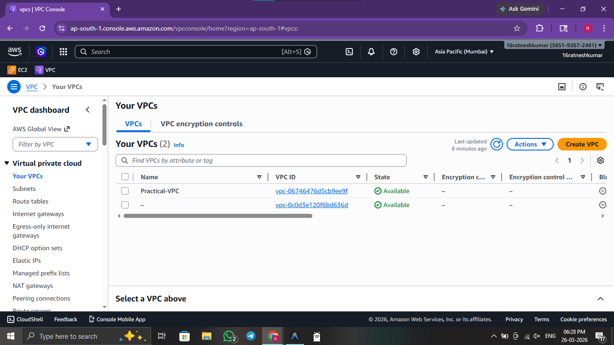
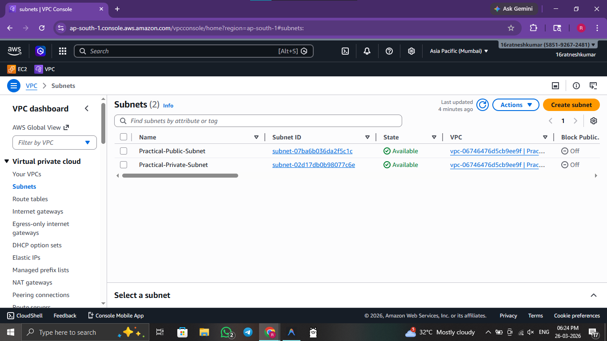
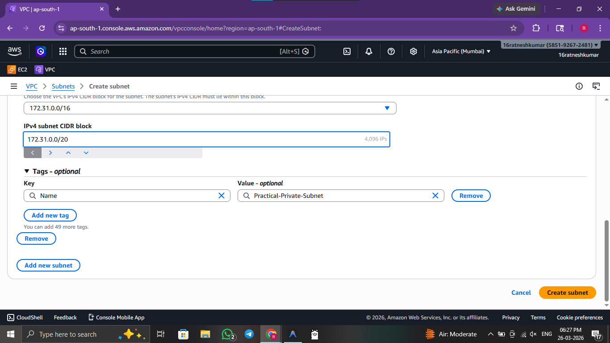
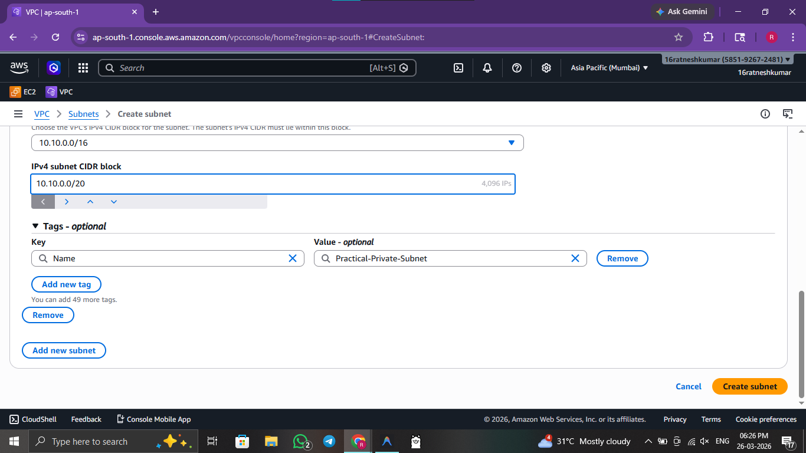
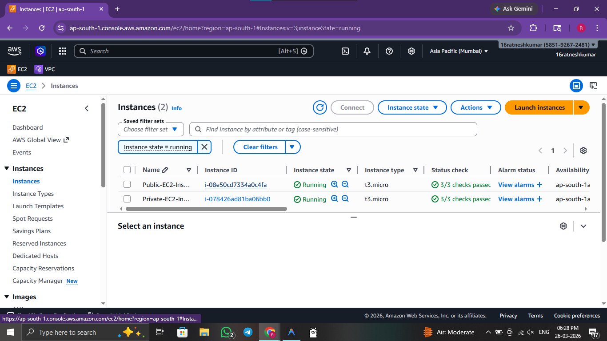

# ☁️ Practical 3: Set Up a VPC

 

> **Objective:** Create and configure a Virtual Private Cloud (VPC) with public and private subnets, enabling routing through Internet and NAT Gateways.

---


## 🖥️ Method 1: Console / GUI Guide (AWS Management Console)

If you prefer to provision infrastructure manually via the Management Console, follow these steps:

1. **Log In:** Navigate to the **VPC Dashboard** in the AWS Console.
2. **Initiate Create:** Click **Create VPC**.
3. **Select Topology:** Select the **VPC and more** wizard to automatically generate subnets, route tables, and gateways, or stick to **VPC only** to build them completely manually.
4. **Provision Subnets:** Ensure you provision at least **one Public Subnet** and **one Private Subnet**.
5. **Internet Access:** Attach an **Internet Gateway** to your VPC to allow external traffic.
6. **NAT Routing:** Create a **NAT Gateway** inside your Public Subnet and update the Private Subnet's route table to direct outbound internet traffic to the NAT Gateway.
7. **Verify:** Launch an EC2 instance in both subnets to verify connectivity differences (SSH into the public one to reach the private one).

---

## 🚀 Method 2: Automated Script Guide

For rapid, reproducible deployments, use the provided bash scripts.

### 🔍 Script Analysis
| Script Name | Action Performed |
| :--- | :--- |
| `3_network_deploy.sh` | 🟢 **Fully automates** custom VPC creation, including a public and private subnet, an Internet Gateway, NAT Gateway, Route Tables, and deploys one EC2 instance into each subnet to demonstrate isolated networking concepts. |
| `3_network_cleanup.sh` | 🔴 **Gracefully tears down** all VPC dependencies in reverse order logic (Instances → NAT → EIP → IGW → Subnets → VPC). |


### 🛠️ Usage Instructions

**Prerequisites:** 
- AWS CLI installed and configured with active credentials.

Execute the following commands from the root directory:

```bash
# 1. Navigate to scripts folder
cd scripts/

# 2. Provide execution permission
chmod +x 3_network_deploy.sh 3_network_cleanup.sh

# 3. Create custom VPC, Subnets, Gateways, and Instances
./3_network_deploy.sh      

# 4. Delete all networking infrastructure
./3_network_cleanup.sh     
```

### 🖼️ Result / Output


*Figure 3.1: AWS VPC Management Console showing the custom Practical-VPC.*


*Figure 3.2: Configured public and private subnets with respective CIDR blocks.*


*Figure 3.3: Step-by-step creation of the public-facing subnet.*


*Figure 3.4: Logical partitioning of the isolated private subnet.*


*Figure 3.5: Launching an EC2 instance within the structured VPC networking.*

---
[⬅️ Previous](2.md) | [🏠 Index](README.md) | [Next ➡️](4.md)