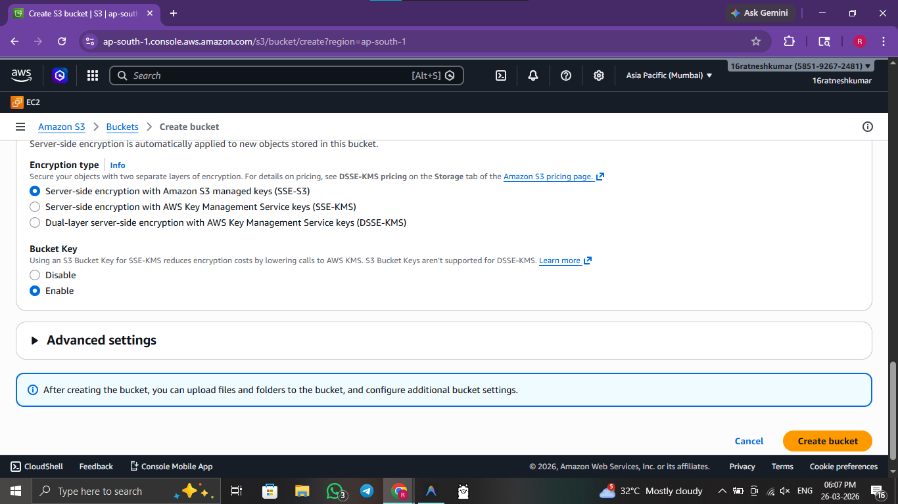
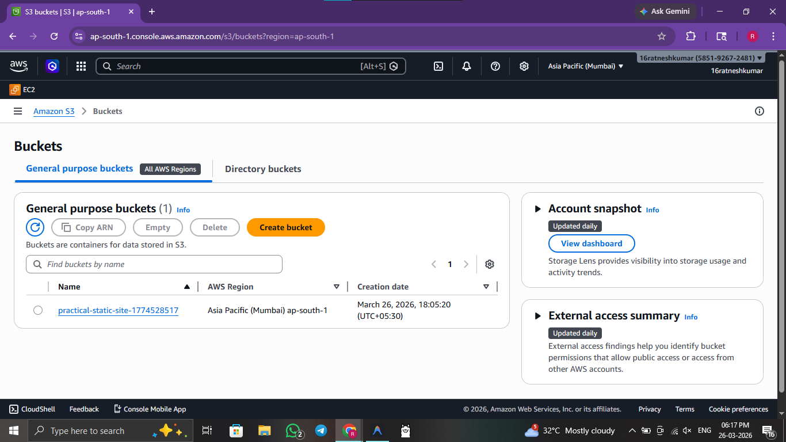
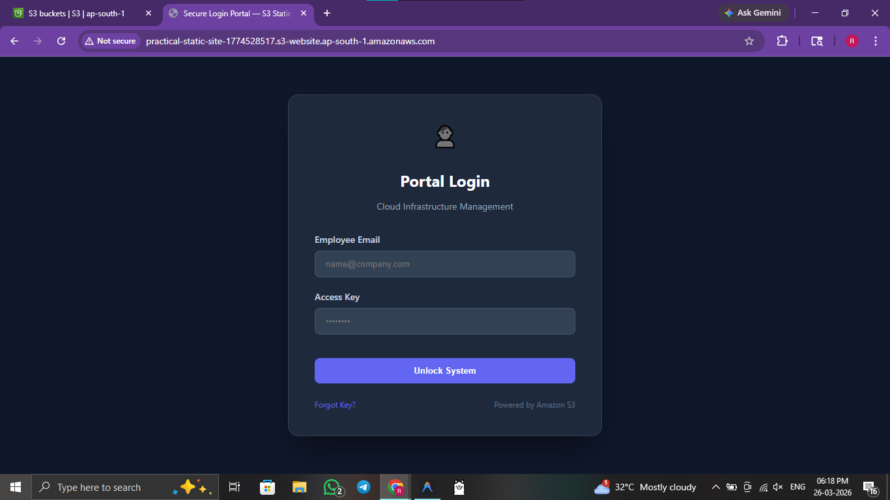
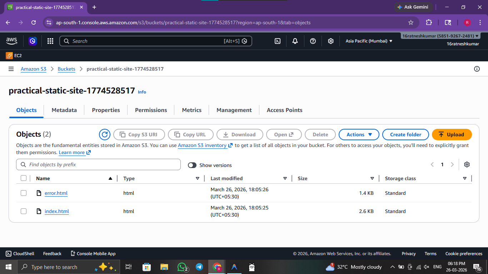

# ☁️ Practical 5: Deploying a Static Website on the Cloud

 

> **Objective:** Host a static cloud website using AWS S3 storage services.

---


## 🖥️ Method 1: Console / GUI Guide (AWS Management Console)

If you prefer to provision infrastructure manually via the Management Console, follow these steps:

1. **Log In:** Open the **S3 Dashboard** in the AWS Console.
2. **Create Bucket:** Click **Create bucket** and enter a globally unique bucket name.
3. **Allow Public Access:** Uncheck **Block all public access** and meticulously acknowledge the UI warning to allow public website visibility.
4. **Upload Files:** After creation, open the bucket and click **Upload** to upload your `index.html` and `style.css` files manually.
5. **Enable Hosting:** Go to the **Properties** tab and enable **Static website hosting**.
6. **Set Permissions:** Go to the **Permissions** tab and append a **Bucket Policy** granting `s3:GetObject` to the principal `*`.
7. **Verify:** Access your site using the provided endpoint URL found sequentially in the properties tab context.

---

## 🚀 Method 2: Automated Script Guide

For rapid, reproducible deployments, use the provided bash scripts.

### 🔍 Script Analysis
| Script Name | Action Performed |
| :--- | :--- |
| `5_storage_deploy.sh` | 🟢 **Provisions** an AWS S3 bucket, dynamically configures bucket policies to heavily allow public read access, and automatically uploads the required HTML/CSS files to host a static storage website. |
| `5_storage_cleanup.sh` | 🔴 **Empties** the S3 bucket of all dependent objects and deletes the bucket itself completely with forced logic. |


### 🛠️ Usage Instructions

**Prerequisites:** 
- AWS CLI installed and configured with active credentials.

Execute the following commands from the root directory:

```bash
# 1. Navigate to scripts folder
cd scripts/

# 2. Provide execution permission
chmod +x 5_storage_deploy.sh 5_storage_cleanup.sh

# 3. Create S3 Bucket and host static website
./5_storage_deploy.sh      

# 4. Empty and delete S3 bucket when finished
./5_storage_cleanup.sh     
```

### 🖼️ Result / Output


*Figure 5.1: Initializing a new S3 bucket for static content hosting.*


*Figure 5.2: AWS S3 Management Console listing active storage buckets.*


*Figure 5.3: Accessing the live static site via the S3 website endpoint.*


*Figure 5.4: Listing uploaded files within the storage bucket.*

---
[⬅️ Previous](4.md) | [🏠 Index](README.md) | [Next ➡️](6.md)
