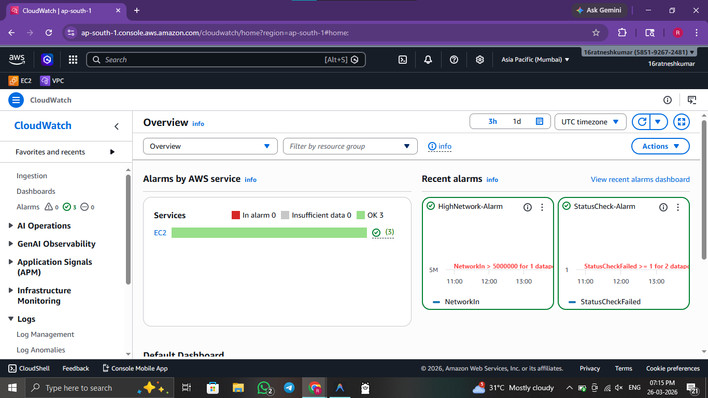
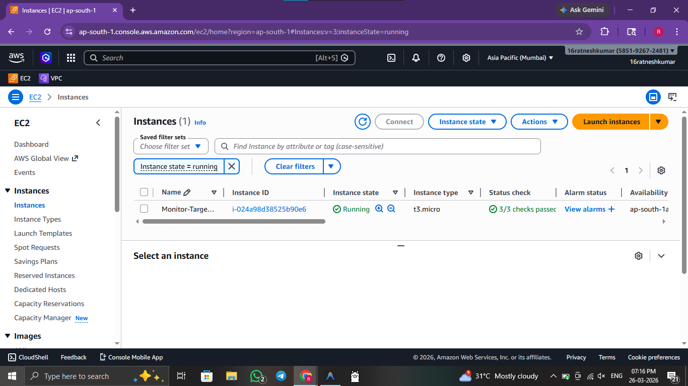
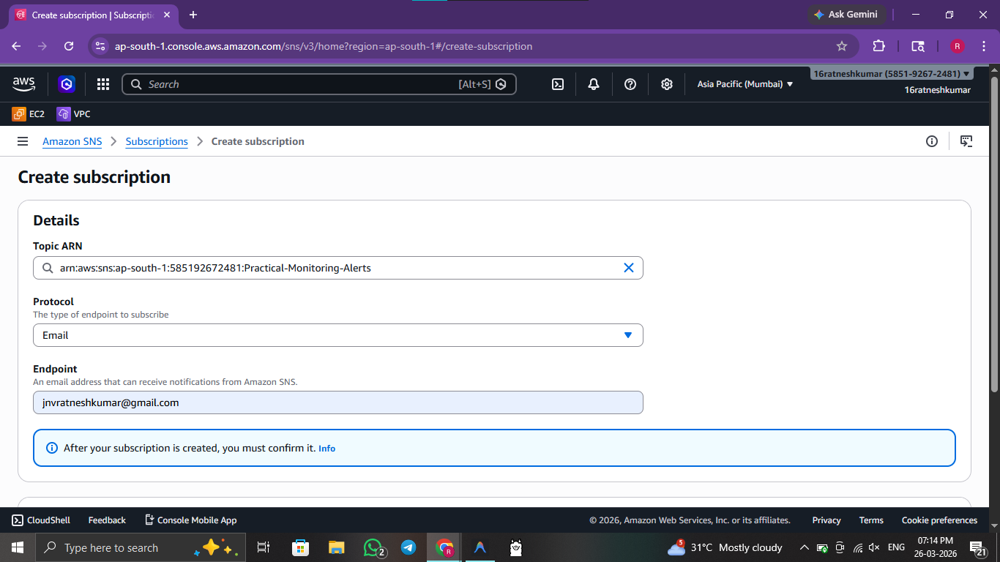
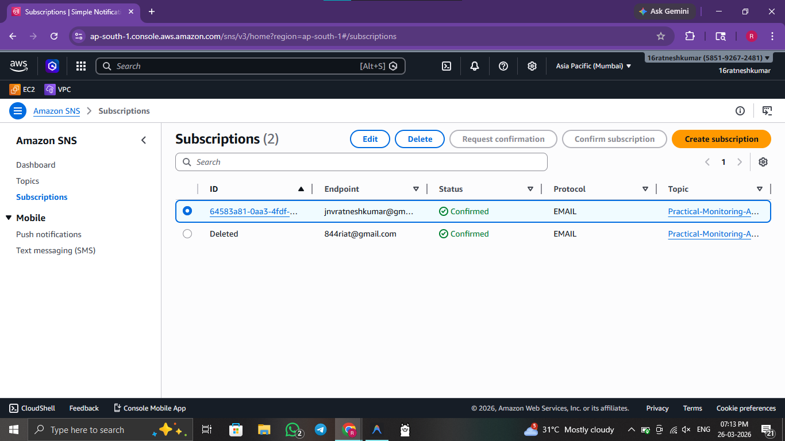

# ☁️ Practical 6: Monitor Resources Using AWS CloudWatch

 

> **Objective:** Use AWS CloudWatch to monitor AWS resources properly and set up triggered SNS Alarms.

---


## 🖥️ Method 1: Console / GUI Guide (AWS Management Console)

If you prefer to provision infrastructure manually via the Management Console, follow these steps:

1. **Log In:** Open the **CloudWatch Dashboard** in the AWS Console.
2. **Find Metrics:** Click **All metrics** and search correctly for **AWS/EC2**.
3. **Select Instance:** Select an existing running EC2 instance and find the specific **CPUUtilization** metric.
4. **Create Alarm:** Go to **Alarms** > **Create alarm** and systematically select the metric you just chose.
5. **Set Threshold:** Set the condition to reliably trigger **Greater than 80%**.
6. **Configure SNS:** In the Notification step, select **Create new topic** (SNS). Enter an email address you have access to.
7. **Confirm Email:** You will need to click the direct confirmation link sent to your email to permanently activate the subscription.

---

## 🚀 Method 2: Automated Script Guide

For rapid, reproducible deployments, use the provided bash scripts.

### 🔍 Script Analysis
| Script Name | Action Performed |
| :--- | :--- |
| `6_monitor_deploy.sh` | 🟢 **Deploys** an EC2 instance and structurally sets up SNS (Simple Notification Service) topics. It attaches a CloudWatch Alarm explicitly configured to trigger an alert if CPU utilization spikes above a predefined threshold. |
| `6_monitor_cleanup.sh` | 🔴 **Deletes** the CloudWatch alarms, firmly un-subscribes users, smoothly deletes the SNS topic, and forcibly terminates the monitored EC2 instance. |


### 🛠️ Usage Instructions

**Prerequisites:** 
- AWS CLI installed and configured with active credentials.

Execute the following commands from the root directory:

```bash
# 1. Navigate to scripts folder
cd scripts/

# 2. Provide execution permission
chmod +x 6_monitor_deploy.sh 6_monitor_cleanup.sh

# 3. Deploy EC2, SNS Topic, and CloudWatch Alarms
./6_monitor_deploy.sh      

# 4. Clean up alarms, topics, and compute instance
./6_monitor_cleanup.sh     
```

### 🖼️ Result / Output


*Figure 6.1: Custom CloudWatch Dashboard showing CPU and Network metrics.*


*Figure 6.2: EC2 instances listed in the CloudWatch monitoring context.*


*Figure 6.3: Successful creation of the SNS notification topic.*


*Figure 6.4: Active email subscription for monitoring alerts.*

---
[⬅️ Previous](5.md) | [🏠 Index](README.md) | [Next ➡️](7.md)