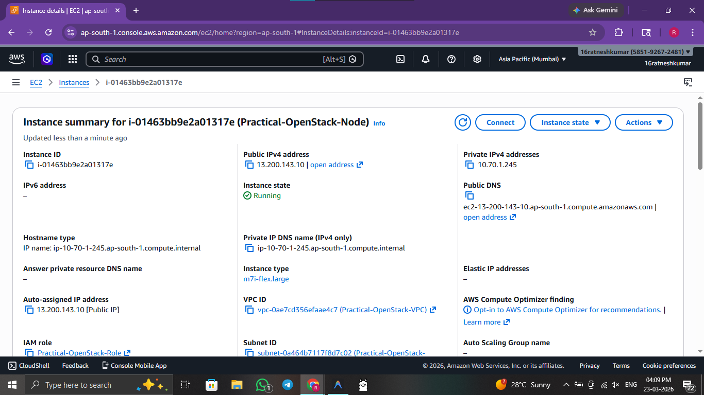
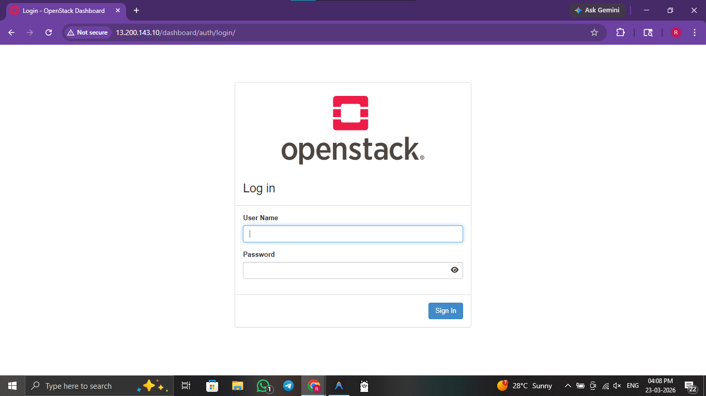
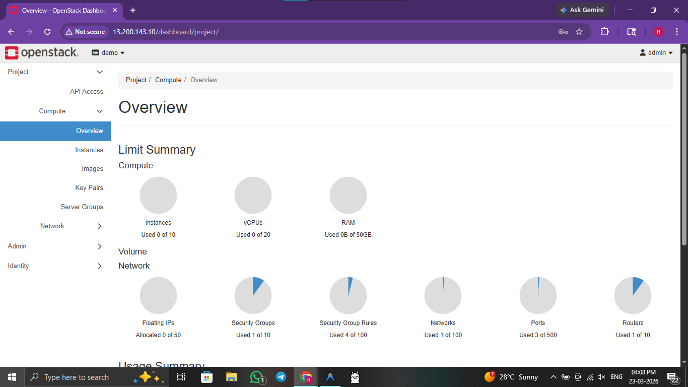
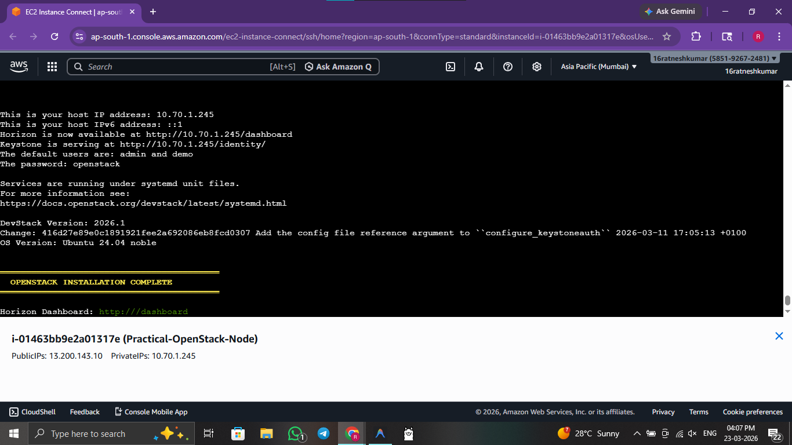

# ☁️ Practical 7: OpenStack Foundation (Single-Node DevStack)

 

> **Objective:** Set up the base infrastructure for an OpenStack environment using DevStack on an AWS EC2 instance.

---


## 🖥️ Method 1: Console / GUI Guide (AWS & Horizon)

If you prefer to provision infrastructure manually via the Management Console, follow these steps:

1. **Host Provisioning:** Launch an AWS EC2 instance (Ubuntu 24.04) with at least **4 vCPUs and 16GB RAM** (m7i-flex.large is recommended).
2. **Storage:** Attach a minimum of **80GB EBS volume** to ensure enough room for OpenStack services and images.
3. **Security:** Open ports **22 (SSH)**, **80 (HTTP)**, and **443 (HTTPS)** in the AWS Security Group.
4. **DevStack Clone:** SSH into the instance and clone the DevStack repository: `git clone https://opendev.org/openstack/devstack`.
5. **Configuration:** Create a `local.conf` file with basic passwords and the `HOST_IP` set to your EC2 public IP.
6. **Installation:** Run `./stack.sh` and wait (approx. 15-20 minutes).
7. **Access:** Once complete, open your browser and navigate to the public IP to access the **Horizon Dashboard**.

---

## 🚀 Method 2: Automated Script Guide

For rapid, reproducible deployments, use the provided bash scripts.

### 🔍 Script Analysis
| Script Name | Action Performed |
| :--- | :--- |
| `7_foundation_deploy.sh` | 🟢 **Automates** the AWS EC2 host creation with specific hardware requirements (m7i-flex.large), sets up the necessary IAM roles, and prepares the environment for DevStack. |
| `7a_foundation_prep.sh` | 🟢 **Installs** system dependencies, creates the `stack` user, and configures the `local.conf` file automatically based on the environment. |
| `7b_foundation_install.sh` | 🟢 **Executes** the main DevStack installation process (`stack.sh`) inside a screen session to ensure persistence. |
| `7c_foundation_unstack.sh` | 🟡 **Gracefully stops** all OpenStack services without deleting the data. |
| `7_foundation_cleanup.sh` | 🔴 **Destroys** the underlying AWS EC2 host and all associated volumes. |


### 🛠️ Usage Instructions

**Prerequisites:** 
- AWS CLI installed and configured.
- Sufficient AWS service quotas for m7i-flex instances.

#### Phase 1: AWS Host Setup
```bash
# 1. Navigate to scripts folder
cd scripts/

# 2. Deploy the AWS EC2 base host
chmod +x 7_foundation_deploy.sh 
./7_foundation_deploy.sh
```

#### Phase 2: OpenStack Installation (Inside EC2)
```bash
# 3. Proceed with DevStack prep and install
chmod +x 7a_foundation_prep.sh 7b_foundation_install.sh 7c_foundation_unstack.sh
./7a_foundation_prep.sh
./7b_foundation_install.sh

# 4. (Optional) Stop OpenStack services safely if needed contextually
./7c_foundation_unstack.sh
```

#### Phase 3: Total Cleanup
```bash
# 5. Deletes the AWS base Host instance completely
chmod +x 7_foundation_cleanup.sh
./7_foundation_cleanup.sh
```

### 🖼️ Result / Output


*Figure 7.1: Detailed view of the AWS EC2 instance hosting the OpenStack environment.*


*Figure 7.2: DevStack Horizon login page accessible via the host's public IP.*


*Figure 7.3: The main OpenStack Horizon dashboard after successful installation.*


*Figure 7.4: Orchestration dashboard showing the status of the deployed stack.*

---
[⬅️ Previous](6.md) | [🏠 Index](README.md) | [Next ➡️](8.md)