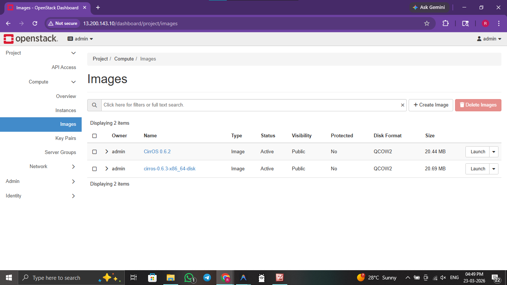
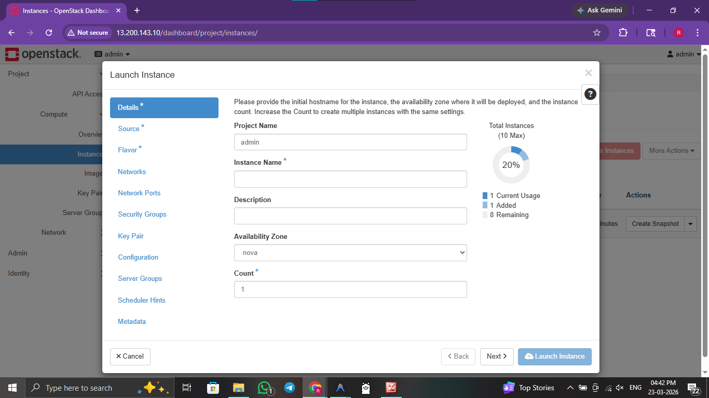
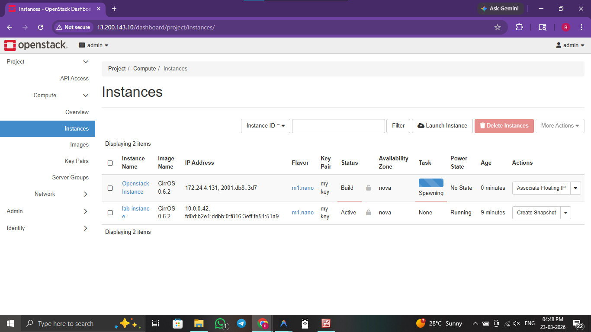

# ☁️ Practical 8: OpenStack Image and Instance Management

  

> **Objective:** Manage cloud images using Glance and launch virtual machine instances using Nova within an OpenStack environment.

---


## 🖥️ Method 1: Console / GUI Guide (OpenStack Horizon)

If you prefer to manage images and instances via the Horizon Dashboard, follow these steps:

1. **Log In:** Access your Horizon Dashboard.
2. **Upload Image:** Go to **Project** > **Compute** > **Images**. Click **Create Image**, provide a name, and upload a `.qcow2` or `.img` file (e.g., Cirros).
3. **Define Flavor:** (Admin only) Go to **Admin** > **Compute** > **Flavors** to see available hardware templates.
4. **Launch VM:** Go to **Project** > **Compute** > **Instances**. Click **Launch Instance**.
5. **Configuration:**
    - **Details:** Name your instance.
    - **Source:** Select the image you uploaded.
    - **Flavor:** Choose a small flavor (e.g., `m1.tiny`).
    - **Networks:** Select the default private network.
6. **Verify:** Once the status is `Active`, use the **Console** tab to log into the VM.

---

## 🚀 Method 2: Automated Script Guide

For rapid, reproducible deployments, use the provided bash scripts.

### 🔍 Script Analysis
| Script Name | Action Performed |
| :--- | :--- |
| `8_instance_deploy.sh` | 🟢 **Automates** the image upload to Glance (using the Cirros lightweight image), creates a custom flavor if needed, and launches a Nova instance with automated health checks to ensure the VM is responsive. |
| `8_image_cleanup.sh` | 🔴 **Deletes** the launched instances and removes the uploaded images from the Glance registry to save storage space. |


### 🛠️ Usage Instructions

**Prerequisites:** 
- OpenStack environment (DevStack) installed and running.
- OpenStack CLI tools installed (`python3-openstackclient`).

Execute the following commands from the root directory:

```bash
# 1. Navigate to scripts folder
cd scripts/

# 2. Provide execution permission
chmod +x 8_instance_deploy.sh 8_image_cleanup.sh

# 3. Upload images, create flavors, and launch VM accurately
./8_instance_deploy.sh     

# 4. Delete VM and related OpenStack entities when securely finished
./8_image_cleanup.sh       
```

### 🖼️ Result / Output


*Figure 8.1: OpenStack Glance service listing available cloud images.*


*Figure 8.2: Launching a new virtual machine instance via the Horizon UI.*


*Figure 8.3: OpenStack Nova dashboard showing the active virtual instance.*

---
[⬅️ Previous](7.md) | [🏠 Index](README.md) | [Next ➡️](9.md)