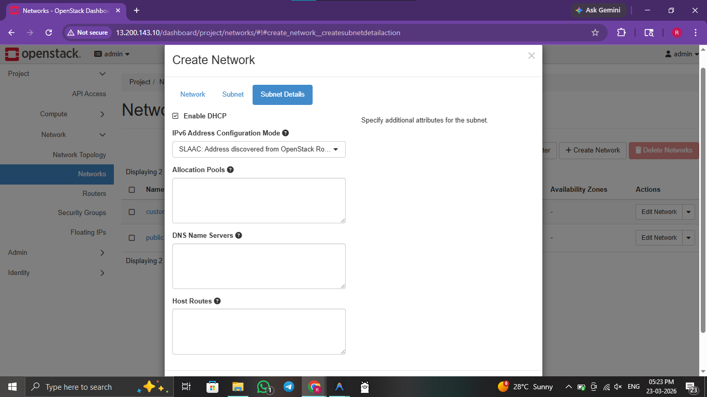
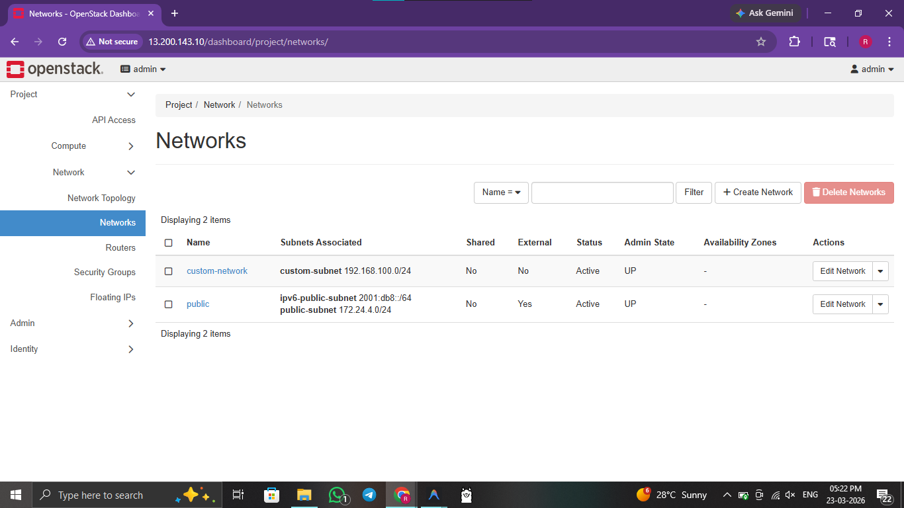
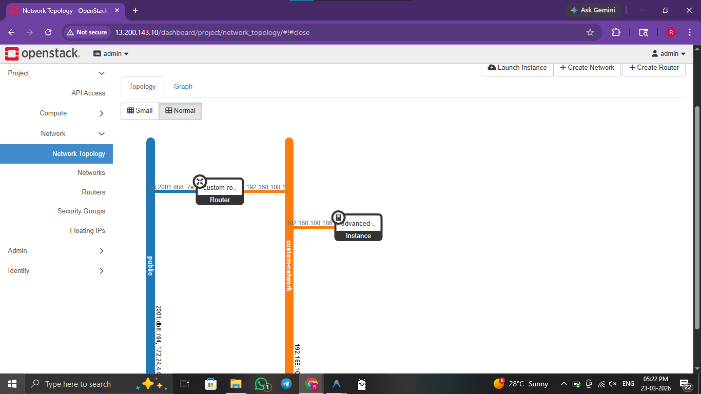
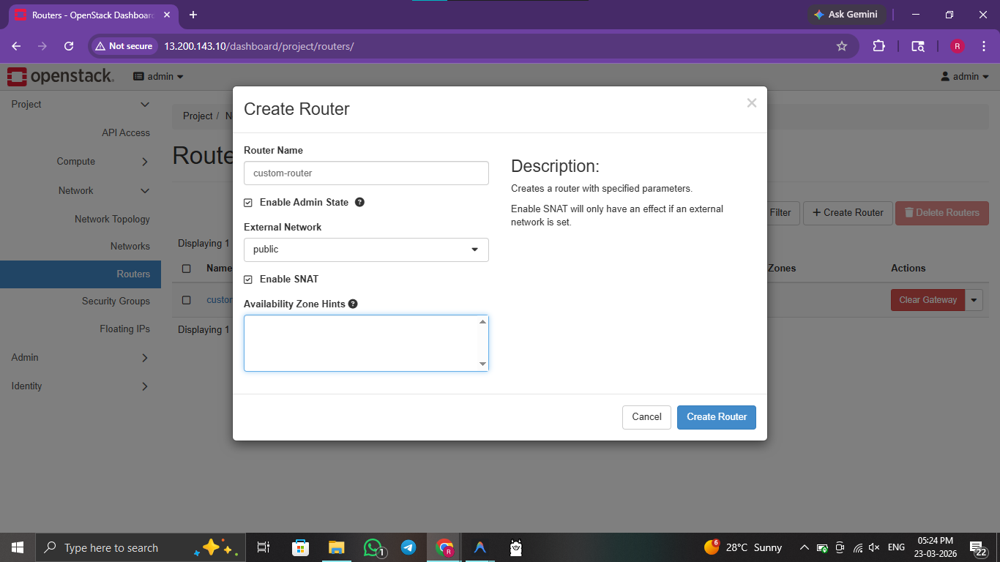
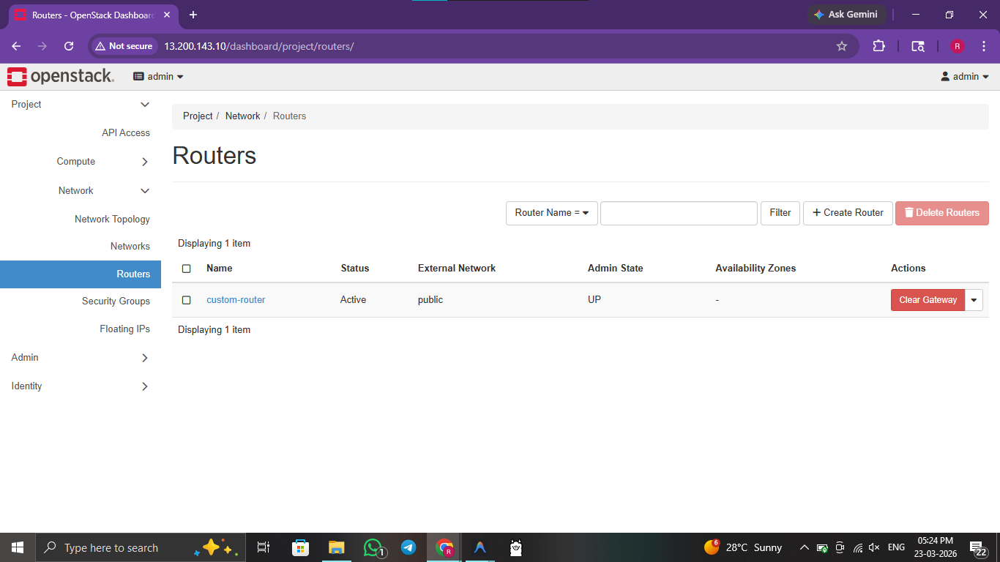
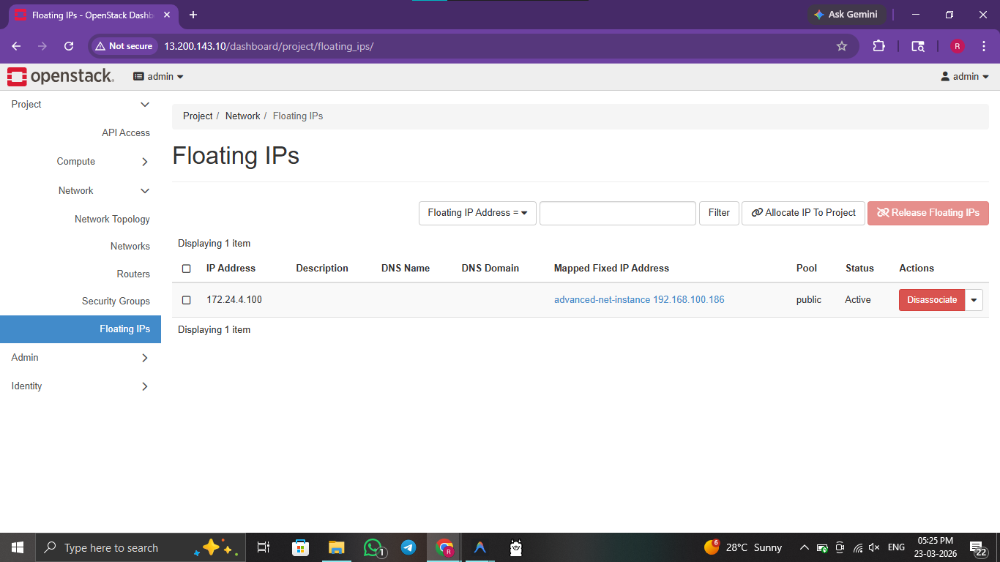

# ☁️ Practical 9: OpenStack Networking (Neutron)

 

> **Objective:** Configure Software-Defined Networking (SDN) in OpenStack using Neutron, including virtual networks, routers, and floating IPs.

---


## 🖥️ Method 1: Console / GUI Guide (OpenStack Horizon)

If you prefer to configure networking via the Horizon Dashboard, follow these steps:

1. **Log In:** Access your Horizon Dashboard.
2. **Create Network:** Go to **Project** > **Network** > **Networks**. Click **Create Network**.
3. **Define Subnet:** Provide a network name and configure a subnet (e.g., `192.168.10.0/24`). Enable DHCP.
4. **Create Router:** Go to **Project** > **Network** > **Routers**. Click **Create Router**.
5. **Set Gateway:** Once created, click **Set Gateway** and select the external/public network.
6. **Add Interface:** Click on the router name, go to the **Interfaces** tab, and click **Add Interface** to connect it to your private subnet.
7. **Floating IP:** Go to **Compute** > **Instances**. On your instance, click the dropdown and select **Associate Floating IP** to map a public IP for external access.

---

## 🚀 Method 2: Automated Script Guide

For rapid, reproducible deployments, use the provided bash scripts.

### 🔍 Script Analysis
| Script Name | Action Performed |
| :--- | :--- |
| `9_neutron_deploy.sh` | 🟢 **Configures** a complete Neutron stack, creating a private network, a subnet with DHCP, a virtual router, and successfully bridges it to the public provider network for external connectivity. |
| `9_neutron_cleanup.sh` | 🔴 **Systematically removes** floating IPs, deletes router interfaces, and destroys the virtual networks to reset the networking state. |


### 🛠️ Usage Instructions

**Prerequisites:** 
- OpenStack environment (DevStack) installed and running.
- Admin or Project user credentials sourced.

Execute the following commands from the root directory:

```bash
# 1. Navigate to scripts folder
cd scripts/

# 2. Provide execution permission
chmod +x 9_neutron_deploy.sh 9_neutron_cleanup.sh

# 3. Set up OpenStack Routers, Networks, and Floating IPs reliably
./9_neutron_deploy.sh      

# 4. Tear down completely OpenStack networking infra when permanently finished
./9_neutron_cleanup.sh     
```

### 🖼️ Result / Output


*Figure 9.1: Creating a custom software-defined network in OpenStack.*


*Figure 9.2: OpenStack Neutron dashboard listing configured networks.*


*Figure 9.3: Visualizing the network topology with routers and subnets.*


*Figure 9.4: Configuring a virtual router to bridge internal and external networks.*


*Figure 9.5: Overview of active routers and their gateway interfaces.*


*Figure 9.6: Managing floating IPs for external access to nested instances.*

---
[⬅️ Previous](8.md) | [🏠 Index](README.md) | [Next ➡️](10.md)